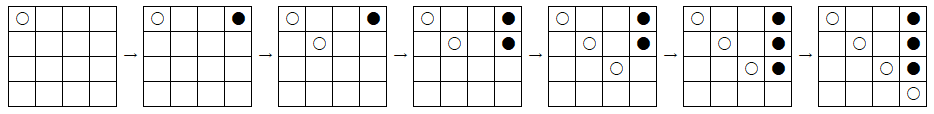

E - XOOOX
====

時間制限 : 5sec / メモリ制限 : 768MB

配点: 160点

### 問題
UNI君とRITAさんがマルバツゲームで遊んでいます。 しかし、一回の対戦がすぐ終わってしまうのでM*Mの盤面を使ったN目並べをして遊ぶことにしました。 遊び始めたのはいいですが、今度はどこが並んでいるかを探すのが面倒になってしまいました。 石を置く場所(a,b)がK個与えられるので二人に代わって勝敗を判定するプログラムを作成してください。

ゲームのルールは以下の通りです。
- 先攻はUNI君で、二人が交互に石を置きます。(二人は異なる色の石を用います)
- 与えられたK個の石を置く場所が二人の石を置く手順と順番に対応します
- 盤面はM*Mの正方形の盤面で、 上からi番目、左からj番目のセルの座標を(i,j)と表します。
- 縦、横、ななめのいずれかに同じ種類の石が連続してN個以上並んだ時に勝利となります。

与えられる手順のリストは以下の条件を満たします。
- 任意のi番目・j番目(i ≠ j)の手順について、(ai,bi) ≠ (aj,bj)
- すべての手順を実行する前に勝敗が決定することがあります。
- すべての手順を実行しても勝敗が決定しないことがあります。

### 制約
- 4 ≦ N ≦ M ≦ 10<sup>5</sup>
- 与えられる手順の任意のi番目の手順について、1 ≦ ai, bj ≦M
- 1 ≦ K ≦ min(106,M*M)

### 部分点
- N = 4、M = 4、K ≦ 16を満たすデータセットに正解した場合は部分点40点が与えられます。
- N ≦ 100、M ≦100を満たすデータセットに正解した場合は部分点80点が与えられます。

### 入力
入力は以下の形式で標準入力から与えられます。
```
N M
K
a1 b1
a2 b2
...
aK bK 
```

### 出力
勝利した人と勝敗が確定した手順が何手目かを1行で出力してください。
引き分けの場合は'DRAW'と出力してください。
出力の最後に改行してください。

### 入力例1
```
4 4
7
1 1
1 4
2 2
2 4
3 3
3 4
4 4
```

### 出力例1
```
UNI 7
```
ゲームは以下のように進みます

7手目でUNI君の石が斜めにそろうので勝敗が決定します。

### 入力例2
```
4 4
8
1 1
1 4
1 2
2 3
1 3
3 2
4 1
3 1
```

### 出力例2
```
DRAW
```
最後まで手順を実行しても勝敗は決定しません。